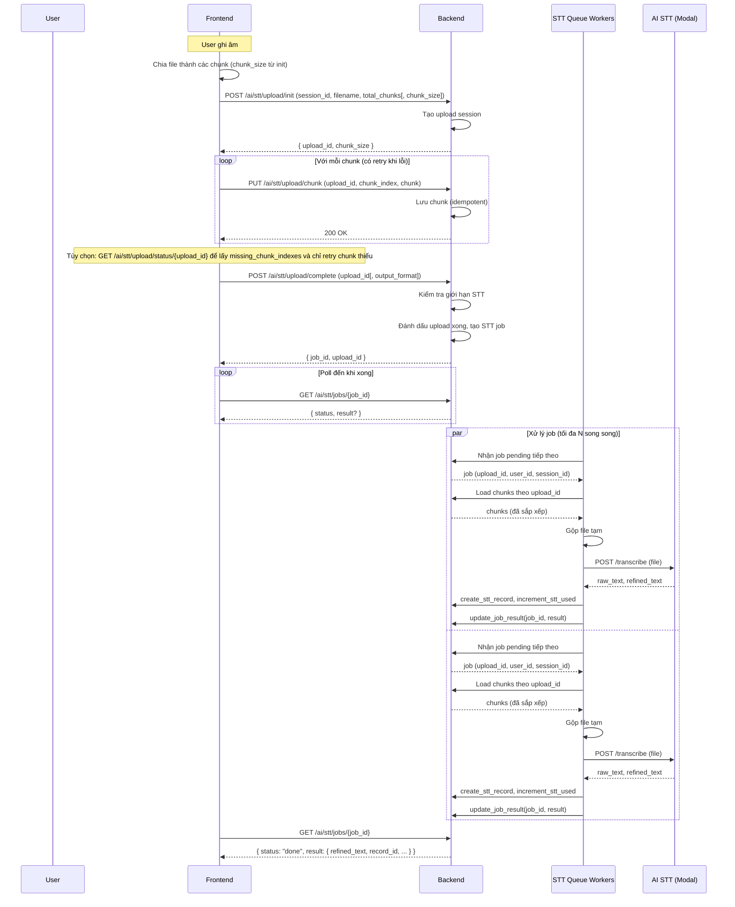
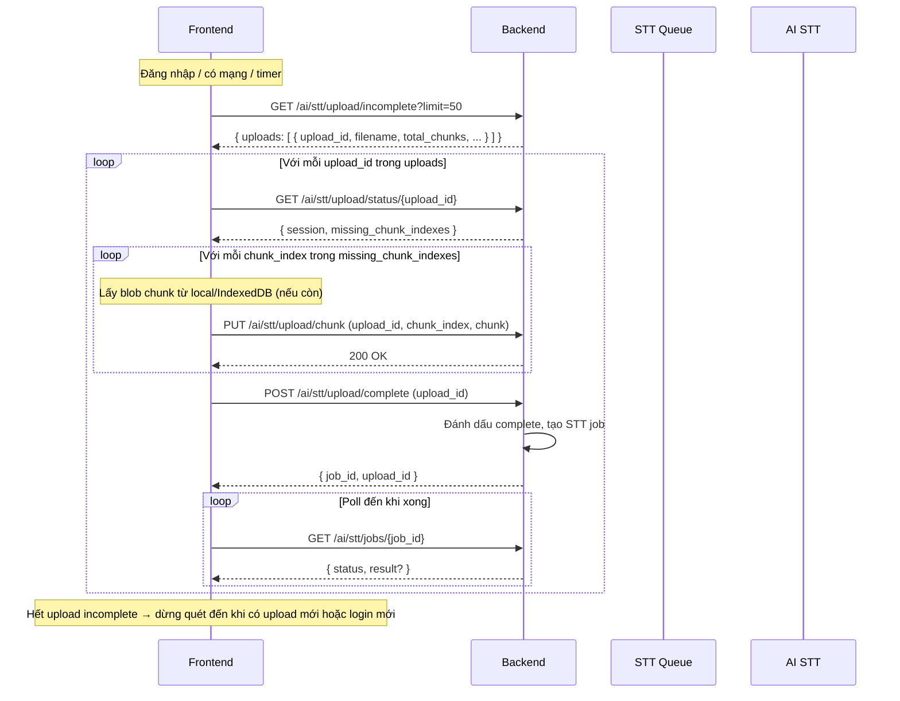

# Sub-project Hypothesis – Tài liệu API

Created time: March 5, 2026 5:41 PM
Last edited time: March 6, 2026 9:58 PM

API cho sub-project **STT hypothesis**: các metric (đăng nhập, giới hạn STT & request thêm, case mỗi ngày), cấu hình/dashboard admin, và bản ghi STT. Tất cả route dùng prefix **`/stt-metrics`**. Xác thực: Bearer token (giống app chính).

---

## Yêu cầu (requirement) – dùng API nào

| Yêu cầu | Mô tả ngắn | API dùng |
| --- | --- | --- |
| **Metric 1 – Đăng nhập + STT** | Theo dõi “≥ 70% user dùng hàng ngày trong N ngày”: user vừa có ít nhất 1 lần đăng nhập trong ngày, vừa có ít nhất 1 lần dùng STT trong ngày đó. | Login: backend tự ghi `user_login_events` khi `POST /auth/login`. STT: mỗi lần STT thành công ghi `stt_records`. Metric 1 = giao của (user đăng nhập trong ngày) và (user có ≥1 STT trong ngày). |
| **Metric 2 – Cấu hình giới hạn STT** | Admin cấu hình: số lượt STT mỗi user, target % user request thêm ít nhất một lượt. | **Admin:** `GET /stt-metrics/config` (xem), `PATCH /stt-metrics/config` (sửa). |
| **Metric 2 – User xem usage / request thêm** | User xem đã dùng bao nhiêu lượt, còn lại bao nhiêu; khi hết thì “request thêm”. | **User:** `GET /stt-metrics/me/usage` (xem), `POST /stt-metrics/me/request-more` (gửi request thêm). |
| **Metric 2 – Chạy STT (ghi âm → text)** | User gửi file âm thanh, nhận bản text (và lưu record). Có giới hạn lượt; vượt thì 402. | `POST /ai/stt` hoặc `POST /ai/stt/transcribe` (gửi file một lần). **Hoặc** luồng chunked upload + queue (upload theo chunk, có thể resume): init → chunk → complete → poll job; chi tiết xem [STT_QUEUE_CHUNKED_UPLOAD.md](https://www.notion.so/medmate/STT_QUEUE_CHUNKED_UPLOAD.md). |
| **Metric 3 – Số case/SOAP mỗi ngày** | User khai báo “mỗi ngày cần viết N case/SOAP”; admin có thể set cho user khác. | **User:** `GET/PUT /stt-metrics/me/daily-required-cases` (chỉ tiêu N), `GET/PUT /stt-metrics/me/daily-actual-cases` (số case đã gặp theo ngày). **Admin:** `PUT /stt-metrics/users/{user_id}/daily-required-cases`. |
| **Metric 3 – Dashboard: case theo ngày theo user** | Admin xem một user tạo bao nhiêu case mỗi ngày + chỉ tiêu mỗi ngày. | **Admin:** `GET /stt-metrics/users/{user_id}/cases-per-day?from_date=...&to_date=...`. |
| **Metric 3 – 10 ngày: STT ≥70% SOAP cần điền/ngày** | User sử dụng ghi chép (STT) cho ít nhất 70% số lượng SOAP note họ cần điền hàng ngày trong vòng 10 ngày. | Trong **overview** (metric3_cases.metric3_10d): `users_meeting_target`, `users_with_requirement`, `percent_meeting_target`. Cửa sổ 10 ngày, target 70%. |
| **Hypothesis test users** | Chỉ tính metric (overview, daily) cho một tập user. | **Admin:** `GET /stt-metrics/config` trả `hypothesis_user_ids` (mảng). `PATCH /stt-metrics/config` với `hypothesis_user_ids: ["id1", "id2", ...]`. Để trống = tất cả user. |
| **Admin tạo user hypothesis** | Tạo user mới theo email, gán đủ quyền hypothesis; trả password để admin giao. | **Admin:** `POST /stt-metrics/admin/create-hypothesis-user` (body: `email`, `name?`, `add_to_hypothesis?`). |
| **Dashboard – Tổng quan** | Admin xem tổng hợp metric 1, 2, 3 trong khoảng ngày (chỉ cho hypothesis users nếu đã cấu hình). | **Admin:** `GET /stt-metrics/overview?from_date=YYYY-MM-DD&to_date=YYYY-MM-DD`. Response có `hypothesis_user_ids` (nếu đang lọc), `metric1_login`, `metric2_stt`, `metric3_cases`. |
| **Dashboard – Chi tiết theo ngày** | Admin xem từng ngày: số login, số user, metric 1 (login+STT), STT uses, số case tạo, actual, tỉ lệ %. | **Admin:** `GET /stt-metrics/daily?from_date=...&to_date=...`. Mỗi dòng có `logins`, `unique_users`, `metric1_users`, `stt_uses`, `cases_created`, `actual_cases`, `ratio_pct`. |
| **Lưu & chỉnh sửa bản ghi STT** | Sau khi chạy STT, user xem danh sách bản ghi, mở một bản, sửa nội dung và lưu. | **User:** `GET /stt-metrics/me/records` (danh sách), `GET /stt-metrics/me/records/{record_id}` (chi tiết), `PATCH /stt-metrics/me/records/{record_id}` (sửa content/display_name và lưu). |

---

## Ai làm được gì

| Vai trò | Quyền |
| --- | --- |
| **Admin** | Cấu hình metric, xem overview/daily, set chỉ tiêu case mỗi ngày cho user bất kỳ, xem cases-per-day của từng user. |
| **User thường** | Xem/cập nhật usage, request thêm, chỉ tiêu case mỗi ngày, danh sách/chi tiết/sửa bản ghi STT. STT: `POST /ai/stt` hoặc `POST /ai/stt/transcribe` (file một lần), hoặc chunked upload + queue (init → chunk → complete → poll job, có thể resume); tất cả đều áp giới hạn lượt. |

---

## Admin – Cấu hình và dashboard

### GET `/stt-metrics/config`

**Quyền:** Chỉ admin.

**Mô tả:** Lấy cấu hình hiện tại (giới hạn lượt STT mỗi user, số ngày cửa sổ metric, target % request thêm).

**Response:** `200 OK`

```json
{
  "stt_requests_limit_per_user": 10,
  "stt_metric_window_days": 10,
  "metric2_target_percent_request_more": 70,
  "updated_at": "2025-02-10T12:00:00"
}
```

**Lỗi:** `403` nếu không phải admin.

---

### PATCH `/stt-metrics/config`

**Quyền:** Chỉ admin.

**Mô tả:** Cập nhật cấu hình metric. Chỉ gửi field nào thì cập nhật field đó.

**Body (tùy chọn):**

| Field | Kiểu | Mô tả |
| --- | --- | --- |
| `stt_requests_limit_per_user` | int (≥ 0) | Số lượt STT mỗi user trước khi phải request thêm. |
| `stt_metric_window_days` | int (1–90) | Số ngày dùng cho metric “dùng hàng ngày”. |
| `metric2_target_percent_request_more` | int (0–100) | Target % user request thêm ít nhất một lượt (vd. 70). |
| `hypothesis_user_ids` | array of string | Nếu có, overview/daily chỉ tính metric cho các user này. Để trống = tất cả user. |
| `metrics_total_users` | int (≥ 0) hoặc null | Tổng số user (mẫu) để tính % cho cả 3 metric. Để null/trống = không hiển thị % (hoặc dùng len(hypothesis_user_ids) nếu có filter). |

**Ví dụ:** `{ "stt_requests_limit_per_user": 15, "metric2_target_percent_request_more": 70, "metrics_total_users": 30 }`

**Response:** `200 OK` – object cấu hình đầy đủ (giống GET).

**Lỗi:** `403` nếu không phải admin; `422` nếu validate lỗi.

---

### POST `/stt-metrics/admin/create-hypothesis-user`

**Quyền:** Chỉ admin.

**Mô tả:** Tạo user mới theo email với đủ quyền hypothesis (AI, STT, cases, v.v.). Trả về `user_id`, `email`, `name`, `password` để admin lưu/giao. Tùy chọn thêm user vào `hypothesis_user_ids`.

**Body:**

| Field | Kiểu | Bắt buộc | Mô tả |
| --- | --- | --- | --- |
| `email` | string | Có | Email đăng nhập (chưa tồn tại). |
| `name` | string | Không | Tên hiển thị; mặc định lấy từ phần trước @ của email. |
| `add_to_hypothesis` | boolean | Không | Nếu true, thêm `user_id` mới vào config `hypothesis_user_ids`. |

**Response:** `201 Created`

```json
{
  "user_id": "oid_hex",
  "email": "user@example.com",
  "name": "User",
  "password": "random_generated_password",
  "add_to_hypothesis": true
}
```

**Lỗi:** `400` nếu email đã tồn tại; `403` nếu không phải admin.

---

### GET `/stt-metrics/overview`

**Quyền:** Chỉ admin.

**Mô tả:** Tổng quan dashboard cho metric 1 (login + STT trong cùng ngày), 2 (STT & request thêm), 3 (case). Có thể truyền khoảng ngày. Các metric có thể trả thêm **% theo mẫu**: `metric1_percent`, `metric2_percent`, `metric3_10d_percent` = count / `total_denominator` * 100. `total_denominator` = config `metrics_total_users` hoặc (nếu null) = số phần tử `hypothesis_user_ids` khi có filter; nếu không có thì không trả %.

**Query:** `from_date`, `to_date` (tùy chọn, `YYYY-MM-DD`).

**Response:** `200 OK` (có thể có thêm `total_denominator`, `metrics_total_users`, `metric1_percent`, `metric2_percent`, `metric3_10d_percent`):

```json
{
  "from": "2025-02-01T00:00:00",
  "to": "2025-02-10T23:59:59",
  "total_denominator": 30,
  "metrics_total_users": 30,
  "metric1_login": {
    "total_logins": 120,
    "unique_users_logged_in": 25,
    "unique_users_login_and_stt": 18,
    "logins_by_day": { "2025-02-01": 12, "2025-02-02": 15, ... },
    "metric1_users_by_day": { "2025-02-01": 8, "2025-02-02": 10, ... }
  },
  "metric2_stt": {
    "stt_requests_limit_per_user": 10,
    "total_stt_used": 80,
    "total_request_more": 5,
    "users_with_usage": 8,
    "users_requested_more": 4,
    "percent_request_more": 50.0,
    "target_percent_request_more": 70
  },
  "metric3_cases": {
    "cases_by_day": { "2025-02-01": 5, ... },
    "cases_by_day_per_user": { "2025-02-01": { "user_id_1": 2, "user_id_2": 3 }, ... }
  }
}
```

**Lỗi:** `403` nếu không phải admin.

---

### GET `/stt-metrics/daily`

**Quyền:** Chỉ admin.

**Mô tả:** Chi tiết theo từng ngày: số login, số user unique, metric 1 (số user vừa login vừa dùng STT trong ngày), số lần dùng STT, số case tạo, actual cases, tỉ lệ %.

**Query:** `from_date`, `to_date` (tùy chọn, `YYYY-MM-DD`).

**Response:** `200 OK` – mảng:

```json
[
  {
    "date": "2025-02-01",
    "logins": 12,
    "unique_users": 8,
    "metric1_users": 5,
    "stt_uses": 20,
    "cases_created": 5,
    "actual_cases": 10,
    "ratio_pct": 50.0
  },
  ...
]
```

**Lỗi:** `403` nếu không phải admin.

---

### GET `/stt-metrics/users/{user_id}/cases-per-day`

**Quyền:** Chỉ admin.

**Mô tả:** Số case tạo mỗi ngày của một user cụ thể, kèm chỉ tiêu SOAP mỗi ngày của user đó.

**Path:** `user_id` – ID user cần xem.

**Query:** `from_date`, `to_date` (tùy chọn, `YYYY-MM-DD`).

**Response:** `200 OK`

```json
{
  "user_id": "abc123",
  "from": "2025-02-01",
  "to": "2025-02-10",
  "cases_by_day": { "2025-02-01": 2, "2025-02-02": 3, ... },
  "daily_required_soap_count": 5
}
```

**Lỗi:** `403` nếu không phải admin.

---

### PUT `/stt-metrics/users/{user_id}/daily-required-cases`

**Quyền:** Chỉ admin.

**Mô tả:** Đặt chỉ tiêu số SOAP/case mỗi ngày cho user khác (metric 3).

**Path:** `user_id` – ID user cần set.

**Body:** `{ "daily_required_soap_count": 5 }`

**Response:** `200 OK` – `{ "user_id": "...", "daily_required_soap_count": 5 }`

**Lỗi:** `403` nếu không phải admin; `422` nếu validate lỗi.

---

## User – Usage và request thêm (metric 2)

### GET `/stt-metrics/me/usage`

**Quyền:** User đã đăng nhập.

**Mô tả:** Usage STT của user hiện tại: đã dùng bao nhiêu, giới hạn, còn lại, đã request thêm mấy lần.

**Response:** `200 OK`

```json
{
  "stt_used_count": 3,
  "stt_requests_limit": 10,
  "stt_remaining": 7,
  "stt_request_more_count": 0
}
```

---

### POST `/stt-metrics/me/request-more`

**Quyền:** User đã đăng nhập.

**Mô tả:** Ghi nhận user “request thêm lượt STT” (cho metric 2: “≥ 70% request ít nhất một lần”). Có thể gửi kèm rating và referred_friend.

**Body (tùy chọn):**

```json
{
  "rating": 4,
  "referred_friend": true
}
```

| Field | Kiểu | Mô tả |
| --- | --- | --- |
| `rating` | int (1–5) | Đánh giá mức độ hài lòng (tùy chọn). |
| `referred_friend` | bool | Có giới thiệu bạn bè (tùy chọn). |

**Response:** `200 OK` – `{ "ok": true, "message": "Request recorded" }`

---

## User – Chỉ tiêu case mỗi ngày (metric 3)

### GET `/stt-metrics/me/daily-required-cases`

**Quyền:** User đã đăng nhập.

**Mô tả:** Lấy chỉ tiêu số SOAP/case mỗi ngày của user hiện tại.

**Response:** `200 OK` – `{ "daily_required_soap_count": 5 }`

---

### PUT `/stt-metrics/me/daily-required-cases`

**Quyền:** User đã đăng nhập.

**Mô tả:** Đặt chỉ tiêu số SOAP mỗi ngày cho chính mình.

**Body:** `{ "daily_required_soap_count": 5 }`

**Response:** `200 OK` – `{ "daily_required_soap_count": 5 }`

---

### PATCH `/stt-metrics/me/daily-cases`

**Quyền:** User đã đăng nhập.

**Mô tả:** Giống PUT trên nhưng dùng field thân thiện `count`. Dùng cho popup trong app (vd. sau 17h) khi user nhập “mỗi ngày cần viết N case”.

**Body:** `{ "count": 5 }`

**Response:** `200 OK` – `{ "count": 5, "daily_required_soap_count": 5 }`

---

### GET `/stt-metrics/me/daily-actual-cases`

**Quyền:** User đã đăng nhập.

**Mô tả:** Lấy số case đã gặp trong ngày (actual cases) của user cho Metric 3 (tỉ lệ actual/required). Có thể lọc theo khoảng ngày.

**Query:** `from_date`, `to_date` (tùy chọn, `YYYY-MM-DD`). Mặc định 30 ngày gần nhất.

**Response:** `200 OK`

```json
{
  "by_date": { "2025-02-10": 5, "2025-02-11": 3 },
  "items": [
    { "_id": "...", "user_id": "...", "date": "2025-02-10", "actual_cases": 5, "updated_at": "..." }
  ]
}
```

`items`: mảng doc từ DB (đã serialize ObjectId/datetime).

---

### PUT `/stt-metrics/me/daily-actual-cases`

**Quyền:** User đã đăng nhập.

**Mô tả:** User tự khai báo số case đã gặp trong một ngày (Metric 3 denominator).

**Body:** `{ "date": "YYYY-MM-DD", "actual_cases": 5 }` (actual_cases: int ≥ 0).

**Response:** `200 OK` – `{ "date": "2025-02-10", "actual_cases": 5 }`

**Lỗi:** `400` nếu date không hợp lệ.

---

## User – Bản ghi STT (danh sách, xem, sửa)

### GET `/stt-metrics/me/records`

**Quyền:** User đã đăng nhập.

**Mô tả:** Danh sách bản ghi STT của user (mới nhất trước). Có thể lọc theo output_type.

**Query:** `skip` (mặc định 0), `limit` (1–100, mặc định 50), `output_type` (tùy chọn: SOAP, todo, summary, free).

**Response:** `200 OK`

```json
{
  "items": [
    {
      "id": "record_id_hex",
      "raw_text": "...",
      "refined_text": "...",
      "content": "...",
      "output_type": "free",
      "format_type": null,
      "status": "completed",
      "error_message": null,
      "elapsed_time": 6.1,
      "created_at": "2025-02-10T12:00:00",
      "updated_at": "2025-02-10T12:05:00",
      "display_name": "Tên tùy chọn"
    }
  ],
  "total": 42,
  "skip": 0,
  "limit": 50
}
```

---

### GET `/stt-metrics/me/records/{record_id}`

**Quyền:** User đã đăng nhập.

**Mô tả:** Lấy một bản ghi STT theo ID. Bản ghi phải thuộc user hiện tại.

**Response:** `200 OK` – một object record (cùng cấu trúc như phần tử trong `items`).

**Lỗi:** `404` nếu không tìm thấy hoặc không thuộc user.

---

### PATCH `/stt-metrics/me/records/{record_id}`

**Quyền:** User đã đăng nhập.

**Mô tả:** Lưu nội dung đã chỉnh sửa (và tùy chọn display_name) cho bản ghi STT. Dùng cho autosave hoặc nút Lưu trong app.

**Body:**

```json
{
  "content": "Nội dung user đã sửa",
  "display_name": "Tên hiển thị (tùy chọn)"
}
```

| Field | Kiểu | Bắt buộc | Mô tả |
| --- | --- | --- | --- |
| `content` | string | Có | Nội dung text đã sửa. |
| `display_name` | string | Không | Nhãn tùy chọn (vd. tên bệnh nhân). |

**Response:** `200 OK` – object record đã cập nhật.

**Lỗi:** `404` nếu không tìm thấy hoặc không thuộc user; `422` nếu validate lỗi.

---

## STT (chuyển giọng thành chữ) – dưới `/ai`

Hai API này không nằm dưới `/stt-metrics` nhưng thuộc sub-project: áp giới hạn lượt STT, tăng usage khi thành công, tạo bản ghi trong `stt_records`.

### POST `/ai/stt`

**Quyền:** User có quyền `can_use_ai` và `can_use_voice_to_text`.

**Mô tả:** Gửi file âm thanh để chuyển thành text (Vietnamese STT / Modal). Áp giới hạn lượt; thành công thì tăng usage và tạo `stt_record`; trả về `record_id`.

**Content-Type:** `multipart/form-data`

**Form:** `session_id` (bắt buộc), `audio` (file, bắt buộc).

**Response:** `200 OK`

```json
{
  "response": {
    "refined_text": "...",
    "raw_text": "...",
    "elapsed_time": 6.1,
    "record_id": "hex_id"
  },
  "record_id": "hex_id"
}
```

**Lỗi:** `402` khi hết lượt (user cần request thêm); `502`/`504` khi lỗi dịch vụ transcription.

---

### POST `/ai/stt/transcribe`

**Quyền:** Giống `/ai/stt`.

**Mô tả:** Giống `/ai/stt` nhưng hỗ trợ chọn format đầu ra (SOAP note, EHR, to-do). Map `output_type`/`format_type` sang Modal (soap_note, ehr, to-do).

**Form:** `audio` (bắt buộc), `session_id` (tùy chọn), `output_type` (tùy chọn, mặc định `free`), `format_type` (tùy chọn).

**Response:** Cùng dạng như `/ai/stt`, có thêm `output_type`, `format_type`, `output_format` trong `response` nếu có.

**Lỗi:** Giống `/ai/stt` (402 khi hết lượt).

---

### Chunked upload & queue (upload có thể resume)

FE có thể dùng **luồng chunked upload + queue** thay cho gửi file một lần: chia file thành chunk, upload từng chunk (idempotent, retry được), complete → tạo job → poll `GET /ai/stt/jobs/{job_id}` đến khi xong. Phù hợp khi mạng không ổn định hoặc cần resume sau khi đăng nhập lại.

| API | Mục đích |
| --- | --- |
| `POST /ai/stt/upload/init` | Tạo session, nhận `upload_id`, `chunk_size`. |
| `PUT /ai/stt/upload/chunk` | Gửi từng chunk (upload_id, chunk_index, chunk). |
| `GET /ai/stt/upload/status/{upload_id}` | Lấy `missing_chunk_indexes` để chỉ retry chunk thiếu. |
| `POST /ai/stt/upload/complete` | Đánh dấu xong, tạo job STT, trả `job_id`. |
| `GET /ai/stt/jobs/{job_id}` | Poll kết quả (status: pending → processing → done/failed). |
| `GET /ai/stt/upload/incomplete` | Danh sách upload đang dở (resume khi đăng nhập/có mạng). |
| `POST /ai/stt/upload/abandon` | Hủy upload khi mất blob. |

**Chi tiết contract, curl, gợi ý FE:** [STT_QUEUE_CHUNKED_UPLOAD.md](https://www.notion.so/medmate/STT_QUEUE_CHUNKED_UPLOAD.md).

---

## Metric 1 – Đăng nhập + STT trong cùng ngày

- **POST /auth/login** – khi đăng nhập thành công, backend ghi vào `user_login_events` (`user_id`, `logged_at`).
- STT: mỗi lần STT thành công (POST /ai/stt, POST /ai/stt/transcribe, hoặc chunked upload + job done) backend ghi `stt_records` (`user_id`, `created_at`).
- **Metric 1** = user có **ít nhất 1 login trong ngày** và **ít nhất 1 lần dùng STT trong ngày đó**. Dashboard dùng giao của hai tập user theo từng ngày; overview trả `unique_users_login_and_stt`, `metric1_users_by_day`; daily trả `metric1_users` mỗi ngày.

---

## Mô hình dữ liệu (collections)

| Collection | Mục đích |
| --- | --- |
| `user_login_events` | Mỗi lần login một doc: `{ user_id, logged_at }`. |
| `stt_user_usage` | Mỗi user một doc: `stt_used_count`, `stt_request_more_count`, `daily_required_soap_count`, `updated_at`, tùy chọn `last_rating`, `referred_friend`. |
| `stt_records` | Mỗi kết quả STT một doc: `user_id`, `session_id`, `output_type`, `format_type`, `raw_text`, `refined_text`, `content`, `status` (completed | failed), `error_message?`, `elapsed_time`, `display_name?`, `created_at`, `updated_at`. User sửa thì cập nhật `content` và `updated_at`. |
| `stt_daily_actual_cases` | Metric 3: mỗi dòng một user + ngày: `user_id`, `date` (YYYY-MM-DD), `actual_cases` (int), `source?`, `updated_at`. User khai báo qua PUT me/daily-actual-cases. |
| `settings` | Doc `_id: "stt_metrics_settings"`: `stt_requests_limit_per_user`, `stt_metric_window_days`, `metric2_target_percent_request_more`, `metrics_total_users?`, `hypothesis_user_ids?`, `updated_at`. |

Dữ liệu case lấy từ collection `cases` có sẵn (`owner_id`, `createdAt`).

---

## FE truyền file qua AI: BE chỉ trung gian chuyển tiếp?

**Hiện tại:** FE gửi file lên BE → BE kiểm tra limit → gọi Modal STT → tăng usage, tạo `stt_record` → trả response cho FE. BE vừa **chuyển tiếp** vừa **áp dụng logic** (giới hạn lượt, metric, lưu bản ghi).

**Các hướng có thể:**

| Cách | Mô tả | Ưu / Nhược |
| --- | --- | --- |
| **1. Giữ như hiện tại (FE → BE → AI)** | BE nhận file từ FE, forward sang Modal, đồng thời check limit, tăng usage, tạo record. | Có kiểm soát lượt, có metric, có lưu bản ghi. BE vẫn là “trung gian chuyển tiếp” nhưng có thêm nghiệp vụ. |
| **2. Thêm endpoint “relay thuần”** | Một endpoint mới (vd. `POST /ai/stt/relay`) chỉ nhận file, forward thẳng sang Modal, trả response; **không** check limit, không tăng usage, không tạo record. | BE chỉ làm trung gian chuyển tiếp. Đổi lại sẽ **mất** giới hạn lượt và không lưu bản ghi (metric 2 không đếm). Chỉ nên dùng nếu không cần limit/record. |
| **3. FE gọi thẳng Modal (không qua BE)** | FE gọi trực tiếp URL Modal (ví dụ `https://...modal.run/transcribe`) từ browser. | BE không đụng tới file. **Nhược:** (a) Modal phải bật CORS cho domain FE; (b) URL/API key (nếu có) sẽ nằm ở FE, dễ lộ; (c) BE không biết ai gọi, không áp limit, không tạo record. Thường **không khuyến nghị** trừ khi Modal được thiết kế cho gọi từ browser và không cần bảo mật. |

**Kết luận:** Cách 1 (hiện tại) vẫn là “FE truyền file qua AI, BE làm trung gian chuyển tiếp”, nhưng BE làm thêm bước check limit + ghi metric + lưu record. Nếu cần BE **chỉ** chuyển tiếp (không limit, không record) thì có thể thêm endpoint relay (cách 2). Nếu muốn FE gọi thẳng AI thì phụ thuộc CORS và chấp nhận mất kiểm soát phía BE (cách 3).

# Sub-project Hypothesis – Tài liệu API (Tiếng Việt)

API cho sub-project **STT hypothesis**: các metric (đăng nhập, giới hạn STT & request thêm, case mỗi ngày), cấu hình/dashboard admin, và bản ghi STT. Tất cả route dùng prefix **`/stt-metrics`**. Xác thực: Bearer token (giống app chính).

---

## Yêu cầu (requirement) – dùng API nào

| Yêu cầu | Mô tả ngắn | API dùng |
| --- | --- | --- |
| **Metric 1 – Đăng nhập + STT** | Theo dõi “≥ 70% user dùng hàng ngày trong N ngày”: user vừa có ít nhất 1 lần đăng nhập trong ngày, vừa có ít nhất 1 lần dùng STT trong ngày đó. | Login: backend tự ghi `user_login_events` khi `POST /auth/login`. STT: mỗi lần STT thành công ghi `stt_records`. Metric 1 = giao của (user đăng nhập trong ngày) và (user có ≥1 STT trong ngày). |
| **Metric 2 – Cấu hình giới hạn STT** | Admin cấu hình: số lượt STT mỗi user, target % user request thêm ít nhất một lượt. | **Admin:** `GET /stt-metrics/config` (xem), `PATCH /stt-metrics/config` (sửa). |
| **Metric 2 – User xem usage / request thêm** | User xem đã dùng bao nhiêu lượt, còn lại bao nhiêu; khi hết thì “request thêm”. | **User:** `GET /stt-metrics/me/usage` (xem), `POST /stt-metrics/me/request-more` (gửi request thêm). |
| **Metric 2 – Chạy STT (ghi âm → text)** | User gửi file âm thanh, nhận bản text (và lưu record). Có giới hạn lượt; vượt thì 402. | `POST /ai/stt` hoặc `POST /ai/stt/transcribe` (gửi file một lần). **Hoặc** luồng chunked upload + queue (upload theo chunk, có thể resume): init → chunk → complete → poll job; chi tiết xem [STT_QUEUE_CHUNKED_UPLOAD.md](https://www.notion.so/medmate/STT_QUEUE_CHUNKED_UPLOAD.md). |
| **Metric 3 – Số case/SOAP mỗi ngày** | User khai báo “mỗi ngày cần viết N case/SOAP”; admin có thể set cho user khác. | **User:** `GET/PUT /stt-metrics/me/daily-required-cases` (chỉ tiêu N), `GET/PUT /stt-metrics/me/daily-actual-cases` (số case đã gặp theo ngày). **Admin:** `PUT /stt-metrics/users/{user_id}/daily-required-cases`. |
| **Metric 3 – Dashboard: case theo ngày theo user** | Admin xem một user tạo bao nhiêu case mỗi ngày + chỉ tiêu mỗi ngày. | **Admin:** `GET /stt-metrics/users/{user_id}/cases-per-day?from_date=...&to_date=...`. |
| **Metric 3 – 10 ngày: STT ≥70% SOAP cần điền/ngày** | User sử dụng ghi chép (STT) cho ít nhất 70% số lượng SOAP note họ cần điền hàng ngày trong vòng 10 ngày. | Trong **overview** (metric3_cases.metric3_10d): `users_meeting_target`, `users_with_requirement`, `percent_meeting_target`. Cửa sổ 10 ngày, target 70%. |
| **Hypothesis test users** | Chỉ tính metric (overview, daily) cho một tập user. | **Admin:** `GET /stt-metrics/config` trả `hypothesis_user_ids` (mảng). `PATCH /stt-metrics/config` với `hypothesis_user_ids: ["id1", "id2", ...]`. Để trống = tất cả user. |
| **Admin tạo user hypothesis** | Tạo user mới theo email, gán đủ quyền hypothesis; trả password để admin giao. | **Admin:** `POST /stt-metrics/admin/create-hypothesis-user` (body: `email`, `name?`, `add_to_hypothesis?`). |
| **Dashboard – Tổng quan** | Admin xem tổng hợp metric 1, 2, 3 trong khoảng ngày (chỉ cho hypothesis users nếu đã cấu hình). | **Admin:** `GET /stt-metrics/overview?from_date=YYYY-MM-DD&to_date=YYYY-MM-DD`. Response có `hypothesis_user_ids` (nếu đang lọc), `metric1_login`, `metric2_stt`, `metric3_cases`. |
| **Dashboard – Chi tiết theo ngày** | Admin xem từng ngày: số login, số user, metric 1 (login+STT), STT uses, số case tạo, actual, tỉ lệ %. | **Admin:** `GET /stt-metrics/daily?from_date=...&to_date=...`. Mỗi dòng có `logins`, `unique_users`, `metric1_users`, `stt_uses`, `cases_created`, `actual_cases`, `ratio_pct`. |
| **Lưu & chỉnh sửa bản ghi STT** | Sau khi chạy STT, user xem danh sách bản ghi, mở một bản, sửa nội dung và lưu. | **User:** `GET /stt-metrics/me/records` (danh sách), `GET /stt-metrics/me/records/{record_id}` (chi tiết), `PATCH /stt-metrics/me/records/{record_id}` (sửa content/display_name và lưu). |

---

## Ai làm được gì

| Vai trò | Quyền |
| --- | --- |
| **Admin** | Cấu hình metric, xem overview/daily, set chỉ tiêu case mỗi ngày cho user bất kỳ, xem cases-per-day của từng user. |
| **User thường** | Xem/cập nhật usage, request thêm, chỉ tiêu case mỗi ngày, danh sách/chi tiết/sửa bản ghi STT. STT: `POST /ai/stt` hoặc `POST /ai/stt/transcribe` (file một lần), hoặc chunked upload + queue (init → chunk → complete → poll job, có thể resume); tất cả đều áp giới hạn lượt. |

---

## Admin – Cấu hình và dashboard

### GET `/stt-metrics/config`

**Quyền:** Chỉ admin.

**Mô tả:** Lấy cấu hình hiện tại (giới hạn lượt STT mỗi user, số ngày cửa sổ metric, target % request thêm).

**Response:** `200 OK`

```json
{
  "stt_requests_limit_per_user": 10,
  "stt_metric_window_days": 10,
  "metric2_target_percent_request_more": 70,
  "updated_at": "2025-02-10T12:00:00"
}
```

**Lỗi:** `403` nếu không phải admin.

---

### PATCH `/stt-metrics/config`

**Quyền:** Chỉ admin.

**Mô tả:** Cập nhật cấu hình metric. Chỉ gửi field nào thì cập nhật field đó.

**Body (tùy chọn):**

| Field | Kiểu | Mô tả |
| --- | --- | --- |
| `stt_requests_limit_per_user` | int (≥ 0) | Số lượt STT mỗi user trước khi phải request thêm. |
| `stt_metric_window_days` | int (1–90) | Số ngày dùng cho metric “dùng hàng ngày”. |
| `metric2_target_percent_request_more` | int (0–100) | Target % user request thêm ít nhất một lượt (vd. 70). |
| `hypothesis_user_ids` | array of string | Nếu có, overview/daily chỉ tính metric cho các user này. Để trống = tất cả user. |
| `metrics_total_users` | int (≥ 0) hoặc null | Tổng số user (mẫu) để tính % cho cả 3 metric. Để null/trống = không hiển thị % (hoặc dùng len(hypothesis_user_ids) nếu có filter). |

**Ví dụ:** `{ "stt_requests_limit_per_user": 15, "metric2_target_percent_request_more": 70, "metrics_total_users": 30 }`

**Response:** `200 OK` – object cấu hình đầy đủ (giống GET).

**Lỗi:** `403` nếu không phải admin; `422` nếu validate lỗi.

---

### POST `/stt-metrics/admin/create-hypothesis-user`

**Quyền:** Chỉ admin.

**Mô tả:** Tạo user mới theo email với đủ quyền hypothesis (AI, STT, cases, v.v.). Trả về `user_id`, `email`, `name`, `password` để admin lưu/giao. Tùy chọn thêm user vào `hypothesis_user_ids`.

**Body:**

| Field | Kiểu | Bắt buộc | Mô tả |
| --- | --- | --- | --- |
| `email` | string | Có | Email đăng nhập (chưa tồn tại). |
| `name` | string | Không | Tên hiển thị; mặc định lấy từ phần trước @ của email. |
| `add_to_hypothesis` | boolean | Không | Nếu true, thêm `user_id` mới vào config `hypothesis_user_ids`. |

**Response:** `201 Created`

```json
{
  "user_id": "oid_hex",
  "email": "user@example.com",
  "name": "User",
  "password": "random_generated_password",
  "add_to_hypothesis": true
}
```

**Lỗi:** `400` nếu email đã tồn tại; `403` nếu không phải admin.

---

### GET `/stt-metrics/overview`

**Quyền:** Chỉ admin.

**Mô tả:** Tổng quan dashboard cho metric 1 (login + STT trong cùng ngày), 2 (STT & request thêm), 3 (case). Có thể truyền khoảng ngày. Các metric có thể trả thêm **% theo mẫu**: `metric1_percent`, `metric2_percent`, `metric3_10d_percent` = count / `total_denominator` * 100. `total_denominator` = config `metrics_total_users` hoặc (nếu null) = số phần tử `hypothesis_user_ids` khi có filter; nếu không có thì không trả %.

**Query:** `from_date`, `to_date` (tùy chọn, `YYYY-MM-DD`).

**Response:** `200 OK` (có thể có thêm `total_denominator`, `metrics_total_users`, `metric1_percent`, `metric2_percent`, `metric3_10d_percent`):

```json
{
  "from": "2025-02-01T00:00:00",
  "to": "2025-02-10T23:59:59",
  "total_denominator": 30,
  "metrics_total_users": 30,
  "metric1_login": {
    "total_logins": 120,
    "unique_users_logged_in": 25,
    "unique_users_login_and_stt": 18,
    "logins_by_day": { "2025-02-01": 12, "2025-02-02": 15, ... },
    "metric1_users_by_day": { "2025-02-01": 8, "2025-02-02": 10, ... }
  },
  "metric2_stt": {
    "stt_requests_limit_per_user": 10,
    "total_stt_used": 80,
    "total_request_more": 5,
    "users_with_usage": 8,
    "users_requested_more": 4,
    "percent_request_more": 50.0,
    "target_percent_request_more": 70
  },
  "metric3_cases": {
    "cases_by_day": { "2025-02-01": 5, ... },
    "cases_by_day_per_user": { "2025-02-01": { "user_id_1": 2, "user_id_2": 3 }, ... }
  }
}
```

**Lỗi:** `403` nếu không phải admin.

---

### GET `/stt-metrics/daily`

**Quyền:** Chỉ admin.

**Mô tả:** Chi tiết theo từng ngày: số login, số user unique, metric 1 (số user vừa login vừa dùng STT trong ngày), số lần dùng STT, số case tạo, actual cases, tỉ lệ %.

**Query:** `from_date`, `to_date` (tùy chọn, `YYYY-MM-DD`).

**Response:** `200 OK` – mảng:

```json
[
  {
    "date": "2025-02-01",
    "logins": 12,
    "unique_users": 8,
    "metric1_users": 5,
    "stt_uses": 20,
    "cases_created": 5,
    "actual_cases": 10,
    "ratio_pct": 50.0
  },
  ...
]
```

**Lỗi:** `403` nếu không phải admin.

---

### GET `/stt-metrics/users/{user_id}/cases-per-day`

**Quyền:** Chỉ admin.

**Mô tả:** Số case tạo mỗi ngày của một user cụ thể, kèm chỉ tiêu SOAP mỗi ngày của user đó.

**Path:** `user_id` – ID user cần xem.

**Query:** `from_date`, `to_date` (tùy chọn, `YYYY-MM-DD`).

**Response:** `200 OK`

```json
{
  "user_id": "abc123",
  "from": "2025-02-01",
  "to": "2025-02-10",
  "cases_by_day": { "2025-02-01": 2, "2025-02-02": 3, ... },
  "daily_required_soap_count": 5
}
```

**Lỗi:** `403` nếu không phải admin.

---

### PUT `/stt-metrics/users/{user_id}/daily-required-cases`

**Quyền:** Chỉ admin.

**Mô tả:** Đặt chỉ tiêu số SOAP/case mỗi ngày cho user khác (metric 3).

**Path:** `user_id` – ID user cần set.

**Body:** `{ "daily_required_soap_count": 5 }`

**Response:** `200 OK` – `{ "user_id": "...", "daily_required_soap_count": 5 }`

**Lỗi:** `403` nếu không phải admin; `422` nếu validate lỗi.

---

## User – Usage và request thêm (metric 2)

### GET `/stt-metrics/me/usage`

**Quyền:** User đã đăng nhập.

**Mô tả:** Usage STT của user hiện tại: đã dùng bao nhiêu, giới hạn, còn lại, đã request thêm mấy lần.

**Response:** `200 OK`

```json
{
  "stt_used_count": 3,
  "stt_requests_limit": 10,
  "stt_remaining": 7,
  "stt_request_more_count": 0
}
```

---

### POST `/stt-metrics/me/request-more`

**Quyền:** User đã đăng nhập.

**Mô tả:** Ghi nhận user “request thêm lượt STT” (cho metric 2: “≥ 70% request ít nhất một lần”). Có thể gửi kèm rating và referred_friend.

**Body (tùy chọn):**

```json
{
  "rating": 4,
  "referred_friend": true
}
```

| Field | Kiểu | Mô tả |
| --- | --- | --- |
| `rating` | int (1–5) | Đánh giá mức độ hài lòng (tùy chọn). |
| `referred_friend` | bool | Có giới thiệu bạn bè (tùy chọn). |

**Response:** `200 OK` – `{ "ok": true, "message": "Request recorded" }`

---

## User – Chỉ tiêu case mỗi ngày (metric 3)

### GET `/stt-metrics/me/daily-required-cases`

**Quyền:** User đã đăng nhập.

**Mô tả:** Lấy chỉ tiêu số SOAP/case mỗi ngày của user hiện tại.

**Response:** `200 OK` – `{ "daily_required_soap_count": 5 }`

---

### PUT `/stt-metrics/me/daily-required-cases`

**Quyền:** User đã đăng nhập.

**Mô tả:** Đặt chỉ tiêu số SOAP mỗi ngày cho chính mình.

**Body:** `{ "daily_required_soap_count": 5 }`

**Response:** `200 OK` – `{ "daily_required_soap_count": 5 }`

---

### PATCH `/stt-metrics/me/daily-cases`

**Quyền:** User đã đăng nhập.

**Mô tả:** Giống PUT trên nhưng dùng field thân thiện `count`. Dùng cho popup trong app (vd. sau 17h) khi user nhập “mỗi ngày cần viết N case”.

**Body:** `{ "count": 5 }`

**Response:** `200 OK` – `{ "count": 5, "daily_required_soap_count": 5 }`

---

### GET `/stt-metrics/me/daily-actual-cases`

**Quyền:** User đã đăng nhập.

**Mô tả:** Lấy số case đã gặp trong ngày (actual cases) của user cho Metric 3 (tỉ lệ actual/required). Có thể lọc theo khoảng ngày.

**Query:** `from_date`, `to_date` (tùy chọn, `YYYY-MM-DD`). Mặc định 30 ngày gần nhất.

**Response:** `200 OK`

```json
{
  "by_date": { "2025-02-10": 5, "2025-02-11": 3 },
  "items": [
    { "_id": "...", "user_id": "...", "date": "2025-02-10", "actual_cases": 5, "updated_at": "..." }
  ]
}
```

`items`: mảng doc từ DB (đã serialize ObjectId/datetime).

---

### PUT `/stt-metrics/me/daily-actual-cases`

**Quyền:** User đã đăng nhập.

**Mô tả:** User tự khai báo số case đã gặp trong một ngày (Metric 3 denominator).

**Body:** `{ "date": "YYYY-MM-DD", "actual_cases": 5 }` (actual_cases: int ≥ 0).

**Response:** `200 OK` – `{ "date": "2025-02-10", "actual_cases": 5 }`

**Lỗi:** `400` nếu date không hợp lệ.

---

## User – Bản ghi STT (danh sách, xem, sửa)

### GET `/stt-metrics/me/records`

**Quyền:** User đã đăng nhập.

**Mô tả:** Danh sách bản ghi STT của user (mới nhất trước). Có thể lọc theo output_type.

**Query:** `skip` (mặc định 0), `limit` (1–100, mặc định 50), `output_type` (tùy chọn: SOAP, todo, summary, free).

**Response:** `200 OK`

```json
{
  "items": [
    {
      "id": "record_id_hex",
      "raw_text": "...",
      "refined_text": "...",
      "content": "...",
      "output_type": "free",
      "format_type": null,
      "status": "completed",
      "error_message": null,
      "elapsed_time": 6.1,
      "created_at": "2025-02-10T12:00:00",
      "updated_at": "2025-02-10T12:05:00",
      "display_name": "Tên tùy chọn"
    }
  ],
  "total": 42,
  "skip": 0,
  "limit": 50
}
```

---

### GET `/stt-metrics/me/records/{record_id}`

**Quyền:** User đã đăng nhập.

**Mô tả:** Lấy một bản ghi STT theo ID. Bản ghi phải thuộc user hiện tại.

**Response:** `200 OK` – một object record (cùng cấu trúc như phần tử trong `items`).

**Lỗi:** `404` nếu không tìm thấy hoặc không thuộc user.

---

### PATCH `/stt-metrics/me/records/{record_id}`

**Quyền:** User đã đăng nhập.

**Mô tả:** Lưu nội dung đã chỉnh sửa (và tùy chọn display_name) cho bản ghi STT. Dùng cho autosave hoặc nút Lưu trong app.

**Body:**

```json
{
  "content": "Nội dung user đã sửa",
  "display_name": "Tên hiển thị (tùy chọn)"
}
```

| Field | Kiểu | Bắt buộc | Mô tả |
| --- | --- | --- | --- |
| `content` | string | Có | Nội dung text đã sửa. |
| `display_name` | string | Không | Nhãn tùy chọn (vd. tên bệnh nhân). |

**Response:** `200 OK` – object record đã cập nhật.

**Lỗi:** `404` nếu không tìm thấy hoặc không thuộc user; `422` nếu validate lỗi.

---

## STT (chuyển giọng thành chữ) – dưới `/ai`

Hai API này không nằm dưới `/stt-metrics` nhưng thuộc sub-project: áp giới hạn lượt STT, tăng usage khi thành công, tạo bản ghi trong `stt_records`.

### POST `/ai/stt`

**Quyền:** User có quyền `can_use_ai` và `can_use_voice_to_text`.

**Mô tả:** Gửi file âm thanh để chuyển thành text (Vietnamese STT / Modal). Áp giới hạn lượt; thành công thì tăng usage và tạo `stt_record`; trả về `record_id`.

**Content-Type:** `multipart/form-data`

**Form:** `session_id` (bắt buộc), `audio` (file, bắt buộc).

**Response:** `200 OK`

```json
{
  "response": {
    "refined_text": "...",
    "raw_text": "...",
    "elapsed_time": 6.1,
    "record_id": "hex_id"
  },
  "record_id": "hex_id"
}
```

**Lỗi:** `402` khi hết lượt (user cần request thêm); `502`/`504` khi lỗi dịch vụ transcription.

---

### POST `/ai/stt/transcribe`

**Quyền:** Giống `/ai/stt`.

**Mô tả:** Giống `/ai/stt` nhưng hỗ trợ chọn format đầu ra (SOAP note, EHR, to-do). Map `output_type`/`format_type` sang Modal (soap_note, ehr, to-do).

**Form:** `audio` (bắt buộc), `session_id` (tùy chọn), `output_type` (tùy chọn, mặc định `free`), `format_type` (tùy chọn).

**Response:** Cùng dạng như `/ai/stt`, có thêm `output_type`, `format_type`, `output_format` trong `response` nếu có.

**Lỗi:** Giống `/ai/stt` (402 khi hết lượt).

---

### Chunked upload & queue (upload có thể resume)

FE có thể dùng **luồng chunked upload + queue** thay cho gửi file một lần: chia file thành chunk, upload từng chunk (idempotent, retry được), complete → tạo job → poll `GET /ai/stt/jobs/{job_id}` đến khi xong. Phù hợp khi mạng không ổn định hoặc cần resume sau khi đăng nhập lại.

| API | Mục đích |
| --- | --- |
| `POST /ai/stt/upload/init` | Tạo session, nhận `upload_id`, `chunk_size`. |
| `PUT /ai/stt/upload/chunk` | Gửi từng chunk (upload_id, chunk_index, chunk). |
| `GET /ai/stt/upload/status/{upload_id}` | Lấy `missing_chunk_indexes` để chỉ retry chunk thiếu. |
| `POST /ai/stt/upload/complete` | Đánh dấu xong, tạo job STT, trả `job_id`. |
| `GET /ai/stt/jobs/{job_id}` | Poll kết quả (status: pending → processing → done/failed). |
| `GET /ai/stt/upload/incomplete` | Danh sách upload đang dở (resume khi đăng nhập/có mạng). |
| `POST /ai/stt/upload/abandon` | Hủy upload khi mất blob. |

**Chi tiết contract, curl, gợi ý FE:** [STT_QUEUE_CHUNKED_UPLOAD.md](https://www.notion.so/medmate/STT_QUEUE_CHUNKED_UPLOAD.md).

---

## Metric 1 – Đăng nhập + STT trong cùng ngày

- **POST /auth/login** – khi đăng nhập thành công, backend ghi vào `user_login_events` (`user_id`, `logged_at`).
- STT: mỗi lần STT thành công (POST /ai/stt, POST /ai/stt/transcribe, hoặc chunked upload + job done) backend ghi `stt_records` (`user_id`, `created_at`).
- **Metric 1** = user có **ít nhất 1 login trong ngày** và **ít nhất 1 lần dùng STT trong ngày đó**. Dashboard dùng giao của hai tập user theo từng ngày; overview trả `unique_users_login_and_stt`, `metric1_users_by_day`; daily trả `metric1_users` mỗi ngày.

---

## Mô hình dữ liệu (collections)

| Collection | Mục đích |
| --- | --- |
| `user_login_events` | Mỗi lần login một doc: `{ user_id, logged_at }`. |
| `stt_user_usage` | Mỗi user một doc: `stt_used_count`, `stt_request_more_count`, `daily_required_soap_count`, `updated_at`, tùy chọn `last_rating`, `referred_friend`. |
| `stt_records` | Mỗi kết quả STT một doc: `user_id`, `session_id`, `output_type`, `format_type`, `raw_text`, `refined_text`, `content`, `status` (completed | failed), `error_message?`, `elapsed_time`, `display_name?`, `created_at`, `updated_at`. User sửa thì cập nhật `content` và `updated_at`. |
| `stt_daily_actual_cases` | Metric 3: mỗi dòng một user + ngày: `user_id`, `date` (YYYY-MM-DD), `actual_cases` (int), `source?`, `updated_at`. User khai báo qua PUT me/daily-actual-cases. |
| `settings` | Doc `_id: "stt_metrics_settings"`: `stt_requests_limit_per_user`, `stt_metric_window_days`, `metric2_target_percent_request_more`, `metrics_total_users?`, `hypothesis_user_ids?`, `updated_at`. |

Dữ liệu case lấy từ collection `cases` có sẵn (`owner_id`, `createdAt`).

---

## FE truyền file qua AI: BE chỉ trung gian chuyển tiếp?

**Hiện tại:** FE gửi file lên BE → BE kiểm tra limit → gọi Modal STT → tăng usage, tạo `stt_record` → trả response cho FE. BE vừa **chuyển tiếp** vừa **áp dụng logic** (giới hạn lượt, metric, lưu bản ghi).

**Các hướng có thể:**

| Cách | Mô tả | Ưu / Nhược |
| --- | --- | --- |
| **1. Giữ như hiện tại (FE → BE → AI)** | BE nhận file từ FE, forward sang Modal, đồng thời check limit, tăng usage, tạo record. | Có kiểm soát lượt, có metric, có lưu bản ghi. BE vẫn là “trung gian chuyển tiếp” nhưng có thêm nghiệp vụ. |
| **2. Thêm endpoint “relay thuần”** | Một endpoint mới (vd. `POST /ai/stt/relay`) chỉ nhận file, forward thẳng sang Modal, trả response; **không** check limit, không tăng usage, không tạo record. | BE chỉ làm trung gian chuyển tiếp. Đổi lại sẽ **mất** giới hạn lượt và không lưu bản ghi (metric 2 không đếm). Chỉ nên dùng nếu không cần limit/record. |
| **3. FE gọi thẳng Modal (không qua BE)** | FE gọi trực tiếp URL Modal (ví dụ `https://...modal.run/transcribe`) từ browser. | BE không đụng tới file. **Nhược:** (a) Modal phải bật CORS cho domain FE; (b) URL/API key (nếu có) sẽ nằm ở FE, dễ lộ; (c) BE không biết ai gọi, không áp limit, không tạo record. Thường **không khuyến nghị** trừ khi Modal được thiết kế cho gọi từ browser và không cần bảo mật. |

**Kết luận:** Cách 1 (hiện tại) vẫn là “FE truyền file qua AI, BE làm trung gian chuyển tiếp”, nhưng BE làm thêm bước check limit + ghi metric + lưu record. Nếu cần BE **chỉ** chuyển tiếp (không limit, không record) thì có thể thêm endpoint relay (cách 2). Nếu muốn FE gọi thẳng AI thì phụ thuộc CORS và chấp nhận mất kiểm soát phía BE (cách 3).

---

# Luồng hàng đợi STT và upload theo chunk

Mọi yêu cầu STT từ frontend có thể đi qua **hàng đợi**. Sau khi user ghi âm, FE upload file thành **các chunk** có thể **tự retry** khi kết nối ổn định lại (ví dụ khi user đăng nhập). Backend gộp chunk, đưa job vào queue và gửi lần lượt tới dịch vụ AI STT với **số request song song có thể cấu hình**.

---

## Sơ đồ trình tự



---

## Sơ đồ trình tự: Resume upload khi đăng nhập / có mạng (hoặc quét định kỳ)

FE có thể **tự động lấy danh sách upload chưa đủ chunk**, rồi upload bổ sung các chunk thiếu và gọi complete. Dùng khi user vừa đăng nhập hoặc khi FE quét định kỳ; khi không còn upload nào incomplete thì dừng quét cho đến khi có upload mới hoặc đăng nhập lại.



**Các API dùng trong luồng resume:**

| Thứ tự | API | Mục đích |
| --- | --- | --- |
| 1 | **GET** `/ai/stt/upload/incomplete` | Lấy danh sách upload đang dở (status = uploading). |
| 2 | **GET** `/ai/stt/upload/status/{upload_id}` | Lấy session + `missing_chunk_indexes` để chỉ upload chunk thiếu. |
| 3 | **PUT** `/ai/stt/upload/chunk` | Upload từng chunk thiếu (lặp theo `missing_chunk_indexes`). |
| 4 | **POST** `/ai/stt/upload/complete` | Đánh dấu upload xong, tạo job STT (BE từ chối nếu còn chunk thiếu). |
| 5 | **GET** `/ai/stt/jobs/{job_id}` | Poll đến khi `status === "done"` (hoặc `"failed"`). |
| (tùy chọn) | **POST** `/ai/stt/upload/abandon` | Khi mất blob: đánh dấu hủy, session không còn trong incomplete. |

---

## Tóm tắt luồng

| Bước | Thành phần | Hành động |
| --- | --- | --- |
| 1 | **FE** | User ghi âm. FE chia file thành các chunk (vd. 512KB). |
| 2 | **FE → BE** | `POST /ai/stt/upload/init` với `session_id`, `filename`, `total_chunks`. Tùy chọn `chunk_size`; không gửi thì BE dùng config `stt_upload_chunk_size_bytes`. |
| 3 | **BE** | Tạo upload session, trả về `upload_id`, `chunk_size`. |
| 4 | **FE** | Với mỗi chunk index `0..total_chunks-1`: `PUT /ai/stt/upload/chunk` với `upload_id`, `chunk_index` và dữ liệu chunk. **Idempotent**: cùng chunk_index có thể upload lại (vd. sau khi mất mạng). |
| 5 | **FE** | (Tùy chọn) `GET /ai/stt/upload/status/{upload_id}` trả về `missing_chunk_indexes` để FE chỉ retry các chunk thiếu (vd. khi user đăng nhập lại). |
| 6 | **FE** | Khi upload đủ chunk: `POST /ai/stt/upload/complete` với `upload_id`. BE kiểm tra giới hạn STT, đánh dấu session hoàn thành, tạo STT job, trả về `job_id`. |
| 7 | **BE** | Worker queue (cấu hình `stt_ai_max_parallel_requests`) lần lượt nhận job pending, gộp chunk thành file tạm, gọi AI STT, ghi `stt_record`, tăng usage, cập nhật job `status: done` và `result`. |
| 8 | **FE** | Poll `GET /ai/stt/jobs/{job_id}` đến khi `status === "done"`, sau đó dùng `result.refined_text`, `result.record_id`, v.v. |

---

## API Contract (FE)

### Ping (kiểm tra mạng đến BE)

- **GET** `/ping`
    - **Auth**: Không cần (public).
    - **Response**: `{ "ok": true, "pong": true }` (HTTP 200).
    - FE gọi để xác nhận có kết nối tới backend (vd. trước khi gọi `GET /ai/stt/upload/incomplete` để resume, hoặc khi bật lại quét định kỳ sau khi mất mạng).

### Init

- **POST** `/ai/stt/upload/init`
    - **Form**: `session_id` (bắt buộc), `filename` (mặc định `audio.m4a`), `total_chunks` (bắt buộc), `chunk_size` (tùy chọn).
    - **Response**: `{ "upload_id": string, "chunk_size": number }`.

### Upload chunk (an toàn retry)

- **PUT** `/ai/stt/upload/chunk`
    - **Form**: `upload_id`, `chunk_index`, `chunk` (file/binary).
    - **Response**: `{ "upload_id", "chunk_index" }`.
    - Upload lại cùng `chunk_index` sẽ ghi đè; an toàn khi retry sau lỗi mạng.

### Danh sách upload chưa đủ chunk (resume khi đăng nhập / có mạng)

- **GET** `/ai/stt/upload/incomplete?limit=50`
    - **Response**: `{ "uploads": [ { "upload_id", "session_id", "filename", "total_chunks", "chunk_size", "status", "created_at" }, ... ] }`.
    - Chỉ trả về session có `status === "uploading"` của user hiện tại. FE gọi khi đăng nhập hoặc quét định kỳ để biết cần resume upload nào.

### Trạng thái (để retry sau khi đăng nhập)

- **GET** `/ai/stt/upload/status/{upload_id}`
    - **Response**: `{ "session": { ... }, "missing_chunk_indexes": number[] }`.
    - FE có thể chỉ upload các index còn thiếu khi user online lại.

### Hủy upload (khi mất blob / không thể resume)

- **POST** `/ai/stt/upload/abandon`
    - **Form**: `upload_id`.
    - **Response**: `{ "upload_id", "status": "abandoned" }`.
    - Đánh dấu session là `abandoned`; session sẽ không còn xuất hiện trong `GET /ai/stt/upload/incomplete`. Dùng khi FE đã mất blob và không thể upload tiếp.

### Hoàn thành và đưa vào queue

- **POST** `/ai/stt/upload/complete`
    - **Form**: `upload_id`, `output_format` (tùy chọn, mặc định `soap_note`).
    - **Response**: `{ "job_id": string, "upload_id": string }`.
    - **Lỗi 400** nếu còn chunk thiếu (BE trả về danh sách `missing_chunk_indexes` trong detail). FE phải upload đủ chunk rồi mới gọi complete.
    - Lỗi 402 khi đã hết giới hạn STT.

### Poll kết quả job

- **GET** `/ai/stt/jobs/{job_id}`
    - **Response**: `{ "id", "upload_id", "user_id", "session_id", "status": "pending" | "processing" | "done" | "failed", "result"?: { "refined_text", "raw_text", "elapsed_time", "record_id" }, "error"?, "created_at", "updated_at" }`.

### Danh sách job

- **GET** `/ai/stt/jobs?status_filter=pending|processing|done|failed&limit=50`
    - **Response**: `{ "jobs": [...] }`.

---

## Cấu hình backend (STT metrics settings)

- **`stt_upload_chunk_size_bytes`**: Kích thước chunk mặc định (vd. 524288 = 512KB). FE có thể ghi đè theo từng lần upload qua init.
- **`stt_ai_max_parallel_requests`**: Số request tối đa gửi song song tới dịch vụ AI STT (mặc định 2). Cấu hình trong admin STT metrics.

---

## Gợi ý thư viện FE (Next.js)

- **Chia file thành chunk:** Dùng API native trình duyệt, không cần thư viện:
    - `File.prototype.slice(start, start + chunk_size)` hoặc `Blob.prototype.slice()` để tạo từng chunk theo `chunk_size` từ BE (init).
- **Lưu IndexedDB (upload dở, resume khi đăng nhập/có mạng):**
    - [**Dexie**](https://dexie.org/) (khuyến nghị): wrapper IndexedDB gọn, TypeScript, tương thích Next.js (chạy phía client). Dùng với **dexie-react-hooks** nếu cần reactive (vd. `useLiveQuery` cho danh sách upload incomplete).
    - **Cài:** `npm install dexie` (và `dexie-react-hooks` nếu dùng hook).
    - **Gợi ý schema:** một bảng metadata upload (upload_id, session_id, filename, total_chunks, chunk_size, created_at), một bảng chunk (upload_id, chunk_index, blob) để lưu từng chunk và đọc lại khi retry/resume.
1. **Khi ghi âm xong**: Chia blob thành các chunk theo `chunk_size`, gọi init, rồi upload từng chunk theo thứ tự (hoặc song song với concurrency nhỏ). Lưu `upload_id` và danh sách chunk (hoặc index) vào state local / IndexedDB để có thể resume sau.
2. **Khi upload chunk lỗi**: Retry chunk đó (cùng `upload_id`, `chunk_index`). Có thể back off và retry khi có mạng.
3. **Khi đăng nhập hoặc có mạng**: (Tùy chọn) Gọi `GET /ping` để xác nhận có mạng tới BE. Sau đó gọi `GET /ai/stt/upload/incomplete` để lấy tất cả upload đang dở. Với mỗi `upload_id`: gọi `GET /ai/stt/upload/status/{upload_id}` → chỉ upload các `missing_chunk_indexes` (từ blob/IndexedDB nếu còn) → `POST /ai/stt/upload/complete` → poll `GET /ai/stt/jobs/{job_id}` đến khi xong. **Nếu blob đã mất**: gọi `POST /ai/stt/upload/abandon` với `upload_id` để session không còn hiện trong incomplete.
4. **Quét định kỳ (tùy chọn)**: FE có thể set interval (vd. mỗi 30s) gọi `GET /ping`; nếu thành công (200) thì gọi `GET /ai/stt/upload/incomplete`. Nếu `uploads.length === 0` thì dừng quét; nếu còn item thì xử lý từng upload như bước 3. Khi user bắt đầu một upload mới hoặc vừa đăng nhập thì bật lại quét cho đến khi không còn incomplete.
5. **Khi đã upload đủ chunk**: Gọi `POST /ai/stt/upload/complete`, sau đó poll `GET /ai/stt/jobs/{job_id}` đến khi `status === "done"` (hoặc `"failed"`). Hiển thị `result.refined_text` và link tới `result.record_id` nếu cần.
6. **Giải phóng file tạm và chunk sau khi upload thành công lên BE**: Khi job đã xong (`status === "done"` hoặc `"failed"`), FE **nên xóa ngay** file tạm (blob đã ghi âm) và dữ liệu chunk đã lưu local/IndexedDB cho `upload_id` đó để tránh tốn dung lượng và rác dữ liệu. Không cần giữ blob/chunk sau khi BE đã nhận đủ và xử lý (hoặc đã fail).
7. **Khi mất blob (không thể resume)**: Gọi `POST /ai/stt/upload/abandon` với `upload_id` để đánh dấu hủy; upload đó sẽ không còn trong `GET /ai/stt/upload/incomplete`, tránh quét mãi.

---

## Edge cases và cần lưu ý

| Vấn đề | Cách xử lý |
| --- | --- |
| **Complete khi còn chunk thiếu** | BE từ chối: `POST /ai/stt/upload/complete` trả 400 kèm danh sách `missing_chunk_indexes`. FE phải upload đủ chunk rồi mới complete. |
| **chunk_index ngoài phạm vi** | `chunk_index` phải trong `[0, total_chunks - 1]`. BE từ chối `PUT /ai/stt/upload/chunk` nếu ngoài phạm vi (400). |
| **Upload bỏ dở (mất blob)** | FE gọi `POST /ai/stt/upload/abandon` để session không còn xuất hiện trong `/incomplete`. Nếu không hủy, session vẫn "uploading" và sẽ hiện mãi khi quét. |
| **Hai tab/thiết bị cùng complete** | Chỉ một lần `mark_upload_complete` thành công (atomic); lần sau trả 400 "already complete". |
| **Worker kiểm tra đủ chunk** | Khi xử lý job, worker gộp chunk và kiểm tra `len(chunks) == total_chunks`; thiếu thì job chuyển `failed` với error "missing chunks". Nhờ BE từ chối complete khi thiếu chunk, trường hợp này chỉ xảy ra nếu có lỗi logic hoặc dữ liệu cũ. |
| **Giải phóng file tạm và chunk (FE)** | Sau khi một file đã upload thành công lên BE (job `done` hoặc `failed`), FE cần **giải phóng** file tạm (blob ghi âm) và xóa dữ liệu chunk đã lưu trong IndexedDB / state local cho `upload_id` đó, tránh tích tụ rác và tốn quota. |